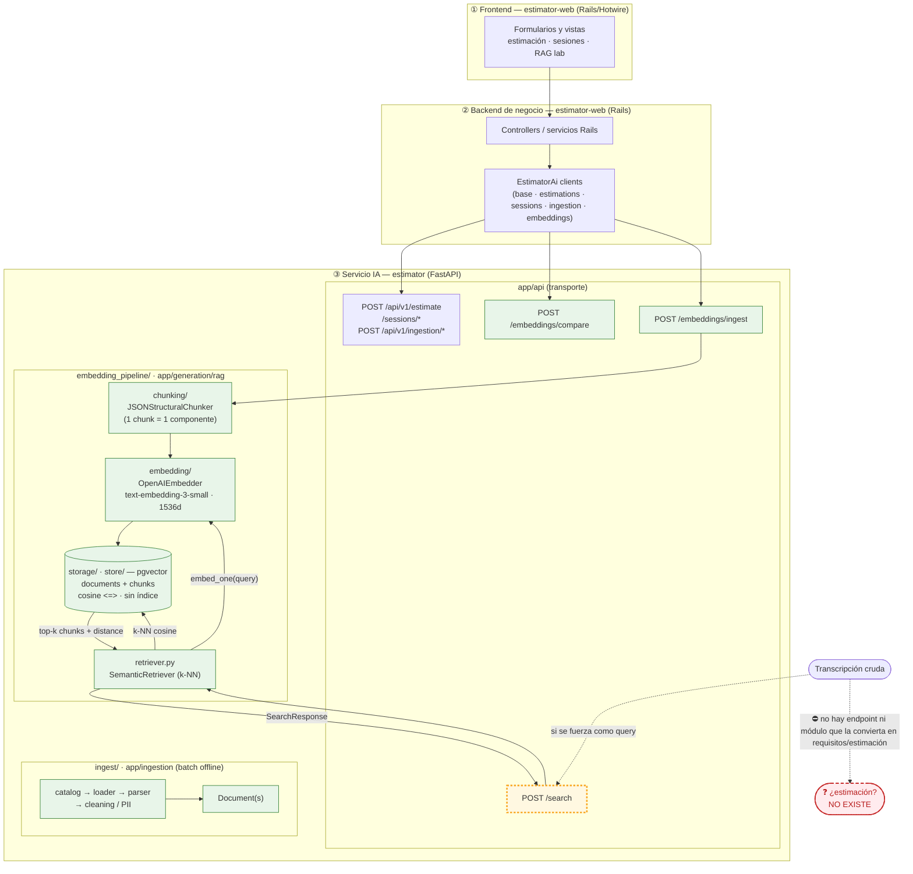
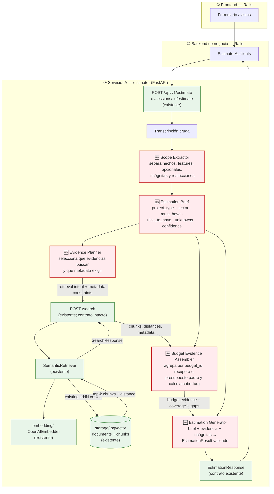

# Diagnóstico arquitectónico — Sesión 09 (pre-work)

Estado del servicio IA `estimator` al cierre de Sesión 08, comportamiento observado al pasarle una
transcripción cruda, fallos concretos y propuesta de evolución hasta cerrar el bucle
transcripción → estimación.

> **Cómo está escrito este documento.** Las observaciones van en español; los comandos, payloads y
> nombres de campo van en inglés. El trace de la sección 2 es reproducible: los comandos están
> puestos tal cual se ejecutan, y la salida real se pega en los bloques marcados
> `<!-- PEGAR SALIDA REAL -->`.

> **Nota de fidelidad.** El enunciado describe el servicio IA con nombres genéricos
> (`ingest/`, `embedding_pipeline/`, `storage/`). El repo real los implementa con otra forma; este
> documento describe la arquitectura **real** del repo: `app/ingestion/` (pipeline batch offline) y
> `app/generation/rag/` (`chunking/`, `embedding/`, `store/`, `retriever.py`, `ingest_service.py`),
> con los endpoints `POST /embeddings/ingest`, `POST /search` y `POST /embeddings/compare`.

---

## 1. Diagrama de la arquitectura actual (cierre S08)

Tres capas. El servicio IA está bajado un nivel. El **borde sombreado** marca dónde acaba lo
implementado hoy: el flujo muere en *"lista de chunks + distancias"*. **No existe ninguna flecha
que vaya desde una transcripción hasta una estimación.**



**Lectura del diagrama.** Lo implementado (verde) cubre (a) los endpoints de negocio (`/estimate`,
`/sessions/*`, `/api/v1/ingestion/*`), (b) el laboratorio de comparación (`/embeddings/compare`) y
(c) el camino RAG de corpus histórico: `/embeddings/ingest` trocea un presupuesto por componente,
lo embebe y lo persiste en pgvector; `/search` vuelve a embeber una consulta y devuelve los *k*
chunks más cercanos por distancia coseno. El borde amarillo (`/search`) es el último eslabón
disponible **si se intenta usar una transcripción como consulta**: su salida es una lista de chunks
con distancias, no una estimación. La caja roja (transcripción → requisitos → estimación) no existe
en ninguna forma; tampoco hay una llamada desde los clientes Rails a `/search`. Ese es exactamente
el hueco que abre la Sesión 09.

---

## 2. Trace anotado de `02_ambiguous.txt`

Cliente: Casa Castaño, tienda gourmet física que quiere "vender por internet", "algo de fidelización
/ puntos", "un panel para ver pedidos y stock", "que la gente pague con tarjeta" y "un correo al
comprar". Divaga, mezcla temas y solo un par de frases dan pistas concretas.

**Preparación (una vez, ya ejecutada):**

```bash
# From the repository root
cd /Users/jorge.ruiz/lidr/ai-engineering/ai-engineering/estimator
docker compose up -d estimator estimator-postgres redis

# Idempotent ingestion of the historical corpus (17 budgets).
# The observed response was: 0 ingested, 17 already present.
docker compose run --rm estimator python scripts/query_examples.py
```

**Trace (script cliente, no añade comportamiento al servicio):**

```bash
export OPENAI_API_KEY=sk-...
uv run examples/trace_s09.py examples/transcripts/02_ambiguous.txt
```

### Paso 1 — Embeber la transcripción completa

El script embebe el texto completo con `text-embedding-3-small` (1536 dims), el mismo modelo que el
servicio usa en ingesta. (No hay endpoint que devuelva el vector crudo: embeber ocurre *dentro* de
`/search`; por eso lo hacemos aquí explícito.)

```text
transcript      : examples/transcripts/02_ambiguous.txt
model           : text-embedding-3-small
dimensionality  : 1536
L2 norm         : 0.999691
first component : 0.006233
last component  : 0.019012
```

> **Comentario.** Un único vector de 1536 dimensiones resume **toda** la transcripción: la tienda
> física, la fidelización, el panel, el pago con tarjeta, la anécdota del primo en Francia y el
> correo de confirmación. Es la media semántica de cinco intenciones distintas más ruido
> conversacional: no representa "lo que el cliente quiere construir", representa "de qué se habló en
> la reunión". La norma ≈ 1.0 confirma que OpenAI normaliza el vector, así que distancia coseno y
> orden por similitud son directamente comparables.

### Paso 2 — Búsqueda semántica (`POST /search`, k=5)

`/search` re-embebe el mismo texto con el mismo modelo y devuelve los 5 chunks más cercanos por
distancia coseno (menor = más parecido). La llamada exacta ejecutada por el script fue:

```bash
curl -sS -X POST http://localhost:8000/search \
  -H 'Content-Type: application/json' \
  --data "$(jq -Rs '{query: ., k: 5}' examples/transcripts/02_ambiguous.txt)"
```

```json
{
  "query": "<omitted here: exact full contents of examples/transcripts/02_ambiguous.txt>",
  "k": 5,
  "search_time_ms": 439,
  "results": [
    { "chunk_id": 16, "document_id": 5, "chunk_type": "budget_component", "content": "[Project: Headless e-commerce storefront with personalized recommendations]\n[Client sector: ecommerce | Year: 2024 | Main tech: node]\n\nComponent: Product catalog API\nDescription: GraphQL catalog API with faceted search, inventory availability and multi-currency pricing backed by Elasticsearch.\nTech stack: node, graphql, elasticsearch\nComplexity: medium\nEstimated hours: 150", "distance": 0.6082955228166176, "metadata": { "year": 2024, "budget_id": "BUD-2024-005", "complexity": "medium", "component_id": "CATALOG-001", "client_sector": "ecommerce", "estimated_hours": 150, "main_technology": "node" } },
    { "chunk_id": 17, "document_id": 5, "chunk_type": "budget_component", "content": "[Project: Headless e-commerce storefront with personalized recommendations]\n[Client sector: ecommerce | Year: 2024 | Main tech: node]\n\nComponent: Cart and checkout service\nDescription: Stateless cart service with promotion engine, tax calculation and a checkout orchestration that integrates the payment provider.\nTech stack: node, redis, postgresql\nComplexity: high\nEstimated hours: 140", "distance": 0.6138128623757041, "metadata": { "year": 2024, "budget_id": "BUD-2024-005", "complexity": "high", "component_id": "CART-002", "client_sector": "ecommerce", "estimated_hours": 140, "main_technology": "node" } },
    { "chunk_id": 18, "document_id": 5, "chunk_type": "budget_component", "content": "[Project: Headless e-commerce storefront with personalized recommendations]\n[Client sector: ecommerce | Year: 2024 | Main tech: node]\n\nComponent: Personalized recommendations\nDescription: Collaborative-filtering recommendations served from a feature store and exposed as a low-latency API for product and cart pages.\nTech stack: node, redis\nComplexity: medium\nEstimated hours: 110", "distance": 0.637239193021222, "metadata": { "year": 2024, "budget_id": "BUD-2024-005", "complexity": "medium", "component_id": "RECO-003", "client_sector": "ecommerce", "estimated_hours": 110, "main_technology": "node" } },
    { "chunk_id": 19, "document_id": 5, "chunk_type": "budget_component", "content": "[Project: Headless e-commerce storefront with personalized recommendations]\n[Client sector: ecommerce | Year: 2024 | Main tech: node]\n\nComponent: Storefront PWA\nDescription: Progressive web app storefront consuming the headless APIs with server-side rendering for SEO.\nTech stack: next_js, react\nComplexity: low\nEstimated hours: 60", "distance": 0.6387455049929066, "metadata": { "year": 2024, "budget_id": "BUD-2024-005", "complexity": "low", "component_id": "STORE-004", "client_sector": "ecommerce", "estimated_hours": 60, "main_technology": "node" } },
    { "chunk_id": 27, "document_id": 8, "chunk_type": "budget_component", "content": "[Project: Fashion returns management and resale portal]\n[Client sector: ecommerce | Year: 2023 | Main tech: dotnet]\n\nComponent: Returns portal\nDescription: Self-service returns portal with label generation, reason capture and automatic restock or resale routing.\nTech stack: dotnet, sqlserver\nComplexity: medium\nEstimated hours: 140", "distance": 0.6443924123988022, "metadata": { "year": 2023, "budget_id": "BUD-2024-008", "complexity": "medium", "component_id": "RET-001", "client_sector": "ecommerce", "estimated_hours": 140, "main_technology": "dotnet" } }
  ]
}
```

> **Nota sobre `query`.** La respuesta real contiene el texto completo de
> `examples/transcripts/02_ambiguous.txt` en este campo, sin transformación. Se muestra como
> `<omitted here: ...>` únicamente para no duplicar en el documento las 45 líneas de la
> transcripción; el comando reproducible anterior reconstruye exactamente ese payload.

### Paso 3 — Lectura de los chunks devueltos

Para cada chunk: a qué presupuesto pertenece, de qué sector es, y si es relevante para lo que pide
Casa Castaño (tienda gourmet que quiere vender online + fidelización + panel + pago con tarjeta).
La lectura de la salida real es:

| # | chunk (componente) | budget_id / sector | distancia | ¿Relevante para el cliente? |
|---|--------------------|--------------------|-----------|------------------------------|
| 1 | `CATALOG-001` Product catalog API | `BUD-2024-005` / ecommerce | `0.6083` | **Sí, parcial** — catálogo y stock encajan, pero GraphQL + Elasticsearch parece sobredimensionado. |
| 2 | `CART-002` Cart and checkout service | `BUD-2024-005` / ecommerce | `0.6138` | **Sí, parcial** — carrito, checkout y proveedor de pagos responden a una necesidad explícita; la complejidad alta no está justificada todavía. |
| 3 | `RECO-003` Personalized recommendations | `BUD-2024-005` / ecommerce | `0.6372` | **No / débil** — el cliente habló de fidelización y puntos, no de recomendaciones colaborativas. Es un falso amigo semántico de ecommerce. |
| 4 | `STORE-004` Storefront PWA | `BUD-2024-005` / ecommerce | `0.6387` | **Sí, parcial** — vender online encaja, pero PWA con SSR para SEO añade decisiones técnicas no solicitadas. |
| 5 | `RET-001` Returns portal | `BUD-2024-008` / ecommerce | `0.6444` | **No** — devoluciones de moda no aparecen en la transcripción; solo comparte el dominio ecommerce. |

> **Comentario honesto.** El resultado es **parcial, no una base suficiente para estimar**. Las
> distancias están comprimidas entre `0.6083` y `0.6444` (solo `0.0361` de diferencia), señal de que
> el vector mezcla ecommerce, fidelización, dashboard, pagos y ruido conversacional. Acertar cuatro
> chunks del mismo presupuesto demuestra que el dominio ecommerce se recupera bien, pero `RECO-003`
> y, sobre todo, el portal de devoluciones muestran que la similitud no entiende el alcance. Además,
> el endpoint devuelve componentes aislados, no el presupuesto completo, restricciones, exclusiones ni
> una suma de horas; por tanto no puede producir una estimación defendible.

---

## 3. Diagnóstico: cinco fallos identificados

Todos anclados al trace de la sección 2.

### Fallo 1 — La transcripción se usa como query, y una transcripción no es una query
- **Problema observado:** embeber los ~600 tokens de divagación de `02_ambiguous.txt` produce un
  vector "promedio" de cinco intenciones + ruido (la tienda del 92, el primo en Francia). En el
  paso 2 eso se traduce en distancias comprimidas (banda `0.6083`–`0.6444`): ningún chunk domina.
- **Causa probable:** no existe ninguna etapa entre la transcripción y `embed_one`. Se embebe el
  texto crudo tal cual; el pipeline asume que la entrada ya es una consulta limpia.
- **Propuesta de solución:** una etapa de **comprensión de query** que destile la transcripción en
  un brief estructurado (qué se quiere construir, features, restricciones) antes de recuperar.

### Fallo 2 — Desajuste de idioma y registro entre query y corpus
- **Problema observado:** la transcripción es español conversacional ("que la gente pague con
  tarjeta", "un panel con el café"); los chunks recuperados están redactados en inglés técnico
  (por ejemplo, `Cart and checkout service` y `Product catalog API`). Aunque cuatro resultados
  pertenecen al ecommerce esperado, el ranking también incluye `Personalized recommendations`,
  una capacidad que el cliente nunca pidió: el dominio común sustituye a una especificación precisa.
- **Causa probable:** un único modelo de embedding aplicado a textos con idioma y registro distintos,
  sin normalización ni traducción del query y sin separar requisitos explícitos de comentarios
  accesorios.
- **Propuesta de solución:** reformular/normalizar el query a una **spec canónica** en el mismo
  idioma y registro técnico que el corpus antes de embeber (encaja con la etapa de comprensión del
  Fallo 1).

### Fallo 3 — Recuperación sin filtrado por metadata
- **Problema observado:** los cuatro primeros hits son componentes de `BUD-2024-005`, pero el quinto
  salta a `BUD-2024-008` (portal de devoluciones de moda) con distancia `0.6444`; ambos son ecommerce,
  pero el segundo proyecto no contiene una necesidad expresada por Casa Castaño. El resultado no
  distingue tampoco entre "fidelización/puntos", catálogo, checkout y devoluciones.
- **Causa probable:** `ChunkStore.search` hace k-NN sobre los ~64 chunks de los 4 sectores sin
  ninguna cláusula `WHERE`; la metadata (`client_sector`, `main_technology`) se persiste pero **no
  se usa para filtrar**.
- **Propuesta de solución:** un **retriever con pre-filtro por metadata** (sector / tipo de proyecto
  inferido del brief) que acote el espacio antes del vector search.

### Fallo 4 — No existe etapa de generación: el bucle no llega a una estimación
- **Problema observado:** la última salida viva del sistema (paso 2) es una lista de chunks con
  distancias. El objetivo del proyecto desde el día uno —transcripción → estimación fundamentada—
  **no se alcanza**: no hay nada después de `/search`.
- **Causa probable:** falta por completo el wiring de **augmentation + generation**; los chunks
  recuperados no se ensamblan en un prompt ni se pasan a un LLM. `EstimationService` existe pero no
  está conectado al retriever.
- **Propuesta de solución:** una etapa de **generación** que ensamble los presupuestos recuperados
  como contexto y produzca un `EstimationResult` validado (Instructor + schema), fundamentado en
  esos presupuestos.

### Fallo 5 — La granularidad del chunk pierde el rollup de coste/horas del presupuesto
- **Problema observado:** cada hit del paso 2 es un *componente* suelto (p.ej. "Cart and checkout
  service · 140h"), no el presupuesto completo. Falta el total de horas/coste del presupuesto padre,
  que es justo el dato necesario para estimar.
- **Causa probable:** `JSONStructuralChunker` produce un chunk por componente (bueno para recuperar
  con precisión) pero no hay chunk ni paso que reconstruya el nivel "presupuesto" (totales, número
  de componentes, plazo).
- **Propuesta de solución:** un **ensamblador de contexto** que, tras recuperar, reagrupe los
  componentes por su `budget_id` y adjunte los totales del presupuesto padre antes de generar.

### Otros (menor prioridad)
- **`k=5` fijo sin umbral de relevancia:** `/search` siempre devuelve 5 resultados aunque todos sean
  malos; no hay corte por distancia mínima. Riesgo de "recuperar basura con confianza".
- **Sin índice vectorial (HNSW):** el `store` hace scan secuencial. Es un problema de *latencia a
  escala*, no de calidad de la respuesta; irrelevante con 64 chunks pero a vigilar.

---

## 4. Propuesta de evolución arquitectónica

Misma arquitectura de tres capas. Las cajas rojas son **nuevas**; las verdes ya existen en la
sección 1. La entrada usa los endpoints de estimación actuales: no se crea ninguna ruta nueva ni se
modifica el contrato de `/search`.



**Responsabilidades y flujo.** *Scope Extractor* convierte la conversación en hechos y separa lo
explícito de lo incierto; *Estimation Brief* lo fija en un contrato con alcance y confianza. *Evidence
Planner* transforma ese brief en intenciones de recuperación y restricciones de metadata, sin cambiar
el endpoint `/search`. *Budget Evidence Assembler* recibe `SearchResponse`, reagrupa por `budget_id`,
recupera el contexto padre y expone cobertura y huecos. *Estimation Generator* combina brief +
evidencia + incógnitas y devuelve el `EstimationResult` validado. El dato que fluye es, por tanto,
transcripción → brief → plan de evidencias → chunks con distancias → evidencia presupuestaria →
estimación. La primera pieza que construiría es *Scope Extractor*: si el alcance sigue mezclando
fidelización, pagos, dashboard y ruido, todo el retrieval y la generación posteriores parten de una
señal equivocada.
